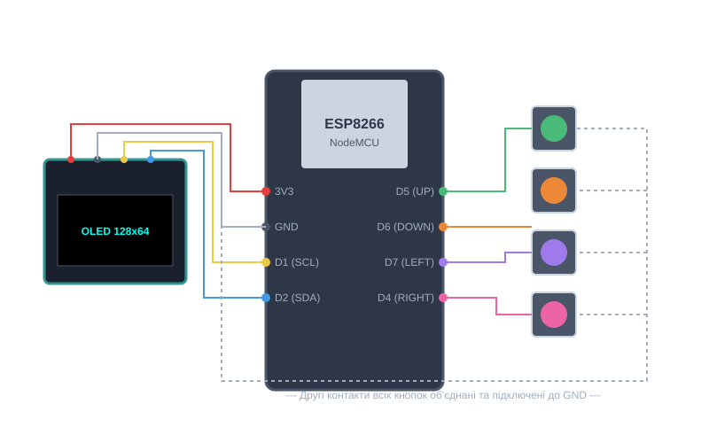

# aPPgame_console_esp8266MODEMCU

Game console based on ESP8266 NodeMCU and an OLED display.

## Connection Diagram

ESP8266 + OLED SSD1306 + 4 Buttons

### ESP8266 NodeMCU Pinout:
* **Power & Display I2C:** `3V3`, `GND`, `D1` (SCL), `D2` (SDA)
* **Buttons:** `D5` (UP), `D6` (DOWN), `D7` (LEFT), `D4` (RIGHT)

### OLED 128x64:
* `VCC`, `GND`, `SCL`, `SDA`

---
* **BTN UP:** `D5`
* **BTN DOWN:** `D6`
* **BTN LEFT:** `D7`
* **BTN RIGHT:** `D4`

--- The second contacts of all buttons are connected together and wired to GND ---
